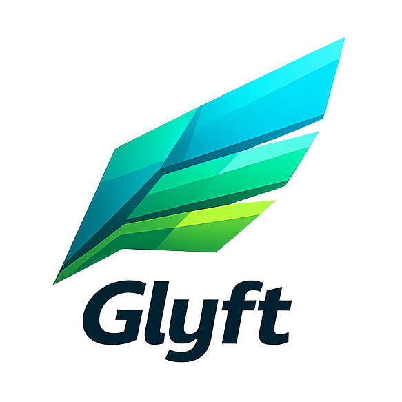

<p align="center">
  
</p>

<h1 align="center">Glyft</h1>

<p align="center">
  <strong>Faster to write. Faster to run.</strong>
</p>

<p align="center">
  Less code. More sprites.<br>
  A WebGL2 framework that moves work from your code to the GPU.
</p>

<p align="center">
  
  
  
  
</p>

<p align="center">
  <a href="https://glyft.dev">Website</a> •
  <a href="https://glyft.dev/docs">Docs</a> •
  <a href="https://glyft.dev/examples">Examples</a> •
  <a href="#quick-start">Quick Start</a>
</p>

---

## The Idea

Most game code is boilerplate: animation state machines, collision callbacks, sound triggers. Glyft handles these declaratively so you can focus on what makes your game unique.

```typescript
// You write this:
player.vx = -100;

// The GPU figures out:
// - Character is moving left
// - Play walk animation
// - Use left-facing sprite row
// - Return to idle when velocity is zero
// - Remember which way you're facing
```

No animation state machine. No frame counters. No direction enums. Set velocity, and animation just works.

## Quick Start

```bash
npm install glyft
```

```typescript
import { Glyft } from 'glyft';

const game = new Glyft(canvas, {
  settings: {
    tileSize: 16,
    viewport: [320, 240],
    spriteMode: '4dir',
  },

  // Collisions as rules, not callbacks
  collisions: {
    '[player]:[enemy]': { damage: 10, knockback: 50, flash: 0.1 },
    '[player]:[coin]': { collect: 'coins', destroy: true },
  },

  // Sounds trigger automatically
  sounds: {
    '[player]:[enemy]': { sound: 'hit.wav', cooldown: 0.5 },
    '[player]:moving': { sound: 'step.wav', interval: 0.25 },
  },

  // GPU particle effects
  particles: {
    hit_sparks: { count: 8, speed: 60, spread: 120, lifetime: 0.3, color: 0xffcc44, colorEnd: 0xff4400, size: 3, sizeEnd: 1, gravity: 100 },
  },
});

const sprites = await game.loadAtlas('sprites.png', 'sprites.json');
const player = game.createSprite(sprites, 'hero');

// Your game loop: just movement logic
game.onUpdate(() => {
  player.vx = 0;
  player.vy = 0;
  if (game.input.isDown('ArrowRight')) player.vx = 100;
  if (game.input.isDown('ArrowLeft')) player.vx = -100;
  if (game.input.isDown('ArrowDown')) player.vy = 100;
  if (game.input.isDown('ArrowUp')) player.vy = -100;
});

game.start();
```

## Why It's Fast

Traditional engines process each sprite individually. That's O(n) CPU work per frame.

Glyft batches everything into a single draw call per texture atlas. Animation, direction, HP bars, labels, and particles are all computed in GPU shaders with zero per-frame allocations.

| Sprites | FPS | Draw Calls |
|---------|-----|------------|
| 1,000 | 60 | 1 |
| 5,000 | 60 | 1 |
| 10,000 | 30-40 | 1 |
| 25,000+ | 15-20 | 1 |

## Features

- **Config-driven** - Collisions, sounds, music, particles defined as data
- **GPU animation** - Velocity-driven direction and frame selection in shaders
- **GPU particle system** - Instanced ring-buffer pool, one draw call, zero allocations
- **GPU HP bars** - Per-sprite health bars rendered entirely on the GPU
- **GPU labels** - Sprite names and icon indicators with proximity visibility
- **GPU floating text** - Damage numbers, pickups, XP popups
- **Declarative SFX** - Design sounds with config, no audio files needed
- **Declarative music** - Melodies and pads from note sequences, no audio files needed
- **Reactive sounds** - Pattern-matched triggers with spatial audio
- **Collision system** - Pattern-based rules with damage, knockback, magnetize, particles
- **Canvas HUD** - Multi-panel stats, level/XP bar, room announcements, dialogue box
- **Addon system** - `game.use()` plugins for projectiles, AI, rooms, dialogue, death, HUD
- **Tween system** - Animate any property with easing curves
- **Tiled map loader** - Import maps from Tiled editor
- **Zero dependencies** - Pure TypeScript + WebGL2

## Addons

Opt-in modules that extend the engine with common game systems. Each addon is self-contained and tree-shakeable.

```typescript
import { projectiles, ai, death, rooms, dialogue, hud } from 'glyft/addons';

game.use(projectiles({ types: { bolt: { speed: 200, cooldown: 0.3 } } }));
game.use(ai({ behaviors: { chaser: { type: 'chase', speed: 30, range: 150 } } }));
game.use(death({ rules: { enemy: { particles: 'burst', xpReward: 10 } } }));
game.use(rooms({ atlas, startRoom: 'village', rooms: { /* ... */ } }));
game.use(dialogue({ dialogues: { elder: { lines: ['Welcome!'], speaker: 'Elder' } } }));
game.use(hud({
  panels: [
    { position: 'top-left', stats: [{ stat: 'hp', label: '\u2665', color: 0xff4444, max: 100 }] },
    { position: 'top-right', stats: [{ stat: 'coins', label: '\u25cf', color: 0xffdd44 }] },
  ],
  announcement: { hold: 2.0 },
  dialogue: {},
}));
```

| Addon | Purpose |
|-------|---------|
| `projectiles` | Fire projectiles with cooldown, lifetime, wall collision |
| `ai` | Enemy behaviors: chase, wander, patrol, flee, idle |
| `death` | HP death checks, rewards, player respawn |
| `rooms` | Room transitions, spawn management, exit detection |
| `dialogue` | NPC interaction with proximity detection and events |
| `hud` | Canvas overlay with stat panels, level/XP bar, announcements, dialogue box |

## Declarative Audio

Define sound effects and music as config data - no audio files required.

```typescript
const config = {
  // Sound effects — procedural synthesis from parameters
  sfx: {
    laser:  { wave: 'sine', freq: 880, duration: 0.15, sweep: 440 },
    coin:   { wave: 'square', freq: 1400, duration: 0.1, sweep: 2100, sweepTime: 0.05 },
    hurt:   { wave: 'sawtooth', freq: 200, duration: 0.2, noise: 0.2 },
  },

  // Music — melodies from note sequences
  music: {
    village: {
      bpm: 56, wave: 'sine',
      notes: ['C4', 'E4', 'G4', 'C5', 'B4', 'G4', 'E4', 'G4'],
      pad: { wave: 'sine', freq: 131, volume: 0.3 },
    },
  },

  // Reactive triggers use sfx names or built-in $presets
  sounds: {
    '[player]:[enemy]': { sound: 'hurt', cooldown: 0.5 },
    '[player]:moving': { sound: '$step', interval: 0.25 },
  },
};
```

## Collision Rules

Pattern `[A]:[B]` means "A encounters B":
- **Effects** (damage, heal, knockback, flash) target A
- **Removal** (destroy, collect) targets B
- **Particles** emit at the collision midpoint

```typescript
collisions: {
  // Player takes 10 damage, enemy is unharmed
  '[player]:[enemy]': { damage: 10, knockback: 80, particles: 'hit_sparks' },
  // Coin is destroyed, player gets +1 coins
  '[player]:[coin]': { collect: 'coins', destroy: true, particles: 'sparkle' },
}
```

## Examples

```bash
git clone https://github.com/AtonalStar/glyft
cd glyft && npm install && npm run dev
# http://localhost:5173/examples/basic/
# http://localhost:5173/examples/benchmark/
# http://localhost:5173/examples/rpg/
```

| Example | Features |
|---------|----------|
| Basic | Tilemap, sprites, enemies, sounds, music, collisions |
| Benchmark | 5K-50K animated sprites, FPS counter |
| RPG | Multi-room dungeon, NPCs, dialogue, combat, projectiles, particles, HP bars, labels |

## License

MIT
